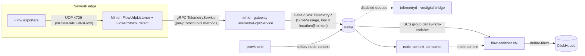

# Delta-V Telemetryd Architecture

This document describes how telemetry ingestion works in Delta-V: the role of the
`telemetryd` daemon, how the flow protocols are (de)coupled from each other, how the
pipeline depends on the Minion, and which backend components scale horizontally via
Spring Cloud Stream.

## Summary

Delta-V's telemetryd is a **pure ingestion bridge** — a deliberately hollowed-out shell
of upstream Horizon's Telemetryd. Every adapter in its configuration is disabled, and the
actual telemetry workload (flows) travels a pipeline that **bypasses telemetryd
entirely**:

```
Minion (UDP listener) ──gRPC──> minion-gateway ──Kafka──> flow-enricher ──> ClickHouse
```

Telemetryd remains deployed as an extension seat for protocols that need event/metric
semantics (BMP peer-status, JTI/NX-OS script adapters) rather than flow-document
semantics, but performs no processing today.

## The three-tier pipeline

Upstream Horizon's telemetryd has a four-part component model — **Listeners** (open
sockets), **Parsers** (frame/decode), **Queues** (transport), **Adapters** (interpret +
persist). Delta-V keeps the conceptual model but redistributes it across containers:

### 1. Minion — listeners + protocol detection

`core/daemon-boot-minion` (`org.deltav.minion.telemetry`):

- `FlowUdpListener` opens a **single UDP port** (`opennms.minion.telemetry.port`,
  default 4729).
- `FlowProtocol.detect()` sniffs the version header of each datagram: `0x0005` →
  Netflow-5, `0x0009` → Netflow-9, `0x000A` → IPFIX, 32-bit `5` → sFlow. This works
  because the four version headers are disjoint (an sFlow packet's first two bytes are
  `0x0000`, so there is no collision with Netflow v5's `0x0005`).
- Each protocol gets its own `FlowSinkModule` and its own `AsyncDispatcher`
  (`TelemetryListenerConfiguration`). Payloads stay **opaque bytes** — nothing beyond
  the 4-byte sniff is parsed on the Minion.
- Lifecycle phase 400: listeners start last, after the Sink client (200) and RPC
  server (300), matching the Trap/Syslog listener pattern.

### 2. minion-gateway — transport translation

`core/minion-gateway` (`org.deltav.gateway.sink.TelemetryGrpcService`):

- The Minion streams datagrams over gRPC using **four protocol-specific bidi methods**
  (`publishIpfix`, `publishNetflow5`, `publishNetflow9`, `publishSflow`) defined in
  `core/minion-grpc-contracts`. Routing is **by RPC method, not payload inspection** —
  the topic decision was already made on the Minion.
- Each method maps to its own Kafka topic (`DeltaV.Sink.Telemetry-<proto>`), keyed
  `<location>@<minion-id>` from the gRPC identity context.
- `SinkKafkaProducer` wraps the raw payload in Horizon's `SinkMessage` protobuf so any
  Horizon-derived consumer can read the topic.
- Per Decision 6, sinks are **lossy by design**: a Kafka publish failure logs and
  continues; the gRPC stream is not torn down.

### 3. Consumers — flow-enricher (real) and telemetryd (vestigial)

- **flow-enricher** consumes all four `DeltaV.Sink.Telemetry-*` topics through one
  Spring Cloud Stream binding and does the actual parsing via per-protocol
  `ProtocolMessageProcessor`s (Netflow-5/9, IPFIX, SFlow), enriches with node context,
  and writes flow documents to `deltav-flows` (ClickHouse ingestion).
- **telemetryd** (`core/daemon-boot-telemetryd`) holds the same *capability*: its
  `TelemetryMessageConsumerManager` spawns one `KafkaSinkBridge` (a dedicated
  `KafkaConsumer` thread) per **enabled** queue, unwraps `SinkMessage`, and dispatches
  to the matching Horizon adapter. But `deploy/overlays/telemetryd/etc/telemetryd-configuration.xml`
  disables all 8 queues (JTI, OpenConfig, Netflow-5/9, IPFIX, SFlow, NXOS, BMP,
  Graphite), so no bridges start today.
- Telemetryd reuses Horizon's `Telemetryd` class unmodified from the pre-built JAR and
  neuters it via dependency injection: the four sub-registries
  (adapter/listener/connector/parser) are wired as no-ops in
  `TelemetrydDaemonConfiguration`. No sockets are ever opened in the daemon.
- The Twin publisher chain (`OpenConfigTwinPublisher` → `KafkaTwinPublisher`) remains
  wired because OpenConfig is a *connector* (daemon-initiated subscription) rather than
  a listener; Twin is how connector config would reach a Minion while honoring the
  Minion-mandatory I/O invariant.

## Protocol-to-protocol coupling

The design is **per-protocol end-to-end**, with three shared chokepoints.

Decoupled per protocol:

| Stage | Per-protocol isolation |
|-------|------------------------|
| Kafka | One topic per protocol (`DeltaV.Sink.Telemetry-Netflow-5`, `-Netflow-9`, `-IPFIX`, `-SFlow`) — backpressure or a poison message in one protocol's topic doesn't touch the others |
| gRPC | One bidi method per protocol on `TelemetryService` — adding a protocol adds a method, a topic constant, and an enum entry; nothing existing changes |
| Minion | One `FlowSinkModule` + `AsyncDispatcher` per protocol |
| telemetryd | One `KafkaSinkBridge` thread per enabled queue |
| flow-enricher | One `ProtocolMessageProcessor` per protocol |

Shared chokepoints (the actual coupling):

1. **One UDP socket on the Minion.** All four flow protocols arrive on port 4729 and
   are demultiplexed by the version-header sniff. A protocol whose leading bytes collide
   could not join this listener — it would need its own port (as JTI or NX-OS would).
2. **Shared gateway plumbing.** All protocols funnel through one
   `TelemetryGrpcService`/`SinkKafkaProducer` and one gRPC channel; lossy-by-design
   keeps a single publish failure from cascading.
3. **One config file / one daemon.** `telemetryd-configuration.xml` defines all queues;
   flow-enricher's topic list is one comma-separated property
   (`DELTAV_FLOWS_SINK_TOPICS`). These are deploy-time couplings, not runtime ones.

The non-flow protocols (JTI, OpenConfig, NXOS, BMP, Graphite) exist only as disabled
config entries — no Minion listener is plumbed for them today. The only fully-plumbed
protocols are the four flow protocols.

## Coupling to the Minion

Total by design — the Minion-mandatory invariant means telemetryd and flow-enricher can
never open a network socket; the Minion is the *only* ingress. The coupling surface is
two thin, versioned contracts:

1. **gRPC contract:** `TelemetryService` in `core/minion-grpc-contracts`
   (`TelemetryDatagram`/`TelemetryAck`). The Minion selects the gRPC dispatcher via
   `opennms.minion.transport.sink.telemetry=grpc` (the default;
   `GrpcTelemetryDispatcherConfiguration`).
2. **Topic naming + framing:** `DeltaV.Sink.<sink-module-id>` with
   `SinkMessage`-wrapped payloads. `FlowProtocol.getSinkModuleId()` on the Minion and
   the consumers' topic subscriptions must agree on those strings — that string
   agreement *is* the coupling.

Identity travels out-of-band: the gateway stamps `<location>@<minion-id>` as the Kafka
record key from the gRPC context, so consumers get provenance (needed for exporter
attribution) without the Minion embedding it per packet.

Crucially, the coupling is **content-blind**: neither the Minion, the gateway, nor
telemetryd's bridge parses a flow packet beyond the 4-byte version sniff. All protocol
semantics live in the consumer (flow-enricher). A protocol can be added, a parser
changed, or the enricher replaced without touching the Minion — and conversely an
alternative Minion implementation (e.g. the Rust Minion) can reimplement the listener
side against the same two wire contracts without any consumer changes.

## Horizontal scaling via Spring Cloud Stream

Kafka consumer groups are the scaling mechanism: every replica of a service joins the
same group, and Kafka assigns each topic partition to exactly one replica in the group.
Spring Cloud Stream (SCS) services get this (plus rebalancing, DLQ, and binding config)
declaratively from `application.yml`; adding replicas requires no code or config change.

### SCS consumers — scale by adding replicas

| Component | Consumes | Group | Notes |
|-----------|----------|-------|-------|
| **flow-enricher** | `DeltaV.Sink.Telemetry-Netflow-5`, `-Netflow-9`, `-IPFIX`, `-SFlow` (one multi-topic binding, `DELTAV_FLOWS_SINK_TOPICS`) | `deltav-flow-enricher` | The primary scale-out point of the telemetry pipeline. Uses `CooperativeStickyAssignor` for incremental rebalancing, so scaling events don't stop-the-world the whole group. Produces to `deltav-flows` with native encoding. |
| **prometheus-writer** | `deltav-timeseries` | `prometheus-writer` | Downstream of the SCS time-series producers (below). Has a DLQ binding (`deltav-prometheus-writer-dlq`), so poison messages are shunted rather than wedging a partition. |

### SCS producers — stateless senders, scale freely

Producers don't join consumer groups; any number of replicas can publish concurrently.
These matter to the pipeline because they feed the SCS-consumed topics:

- **collectd** — publishes collection results to `deltav-timeseries` via its SCS output
  binding.
- **pollerd** and **perspectivepollerd** (via `poller-timeseries-common`'s
  `ResponseTimePublisher`) — publish response-time samples to `deltav-timeseries`.
- **provisiond** — publishes node context to `deltav-node-context`, which flow-enricher's
  enrichment (via `node-context-consumer`-maintained state) depends on.
- **minion-gateway** — not SCS (raw `KafkaProducer`), but stateless per stream; multiple
  gateway instances can run, since each Minion's gRPC stream lands on exactly one
  gateway and topic routing is deterministic.

### Scaling ceilings and caveats

- **Partition count bounds consumer parallelism.** The broker auto-creates topics with
  `KAFKA_NUM_PARTITIONS: 4` (`deploy/compose.yml`). A consumer group therefore gets at
  most 4 active consumers *per topic*. flow-enricher's group spans 4 topics × 4
  partitions = 16 assignable partitions, so up to 16 replicas can share work in
  aggregate — but per-protocol parallelism caps at 4 until partitions are raised.
- **Record keying skews load.** Telemetry records are keyed `<location>@<minion-id>`,
  which preserves per-Minion ordering but maps each Minion to one partition. One very
  busy Minion cannot be spread across replicas; scale-out helps multi-Minion
  deployments, not single-hot-Minion ones.
- **Not SCS, scaling is manual or N/A:**
  - `alarms-materializer`, `alarms-kafka-publisher`, `alerts-forwarder`,
    `node-context-consumer`, `event-forwarder-kafka` use raw `kafka-clients`. They still
    scale via consumer groups if replicas share a `group.id`, but partitioning/ordering
    semantics must be reasoned about per service rather than inherited from SCS
    conventions.
  - telemetryd's `KafkaSinkBridge` is a raw `KafkaConsumer` with a single shared group
    (`opennms-telemetryd-sink`). Multiple telemetryd replicas would divide partitions,
    but since all adapters are disabled there is nothing to scale today.
  - The Minion listener itself scales by deploying more Minions per location (UDP
    fan-in is an exporter-side concern), not by consumer groups.

## Diagram


