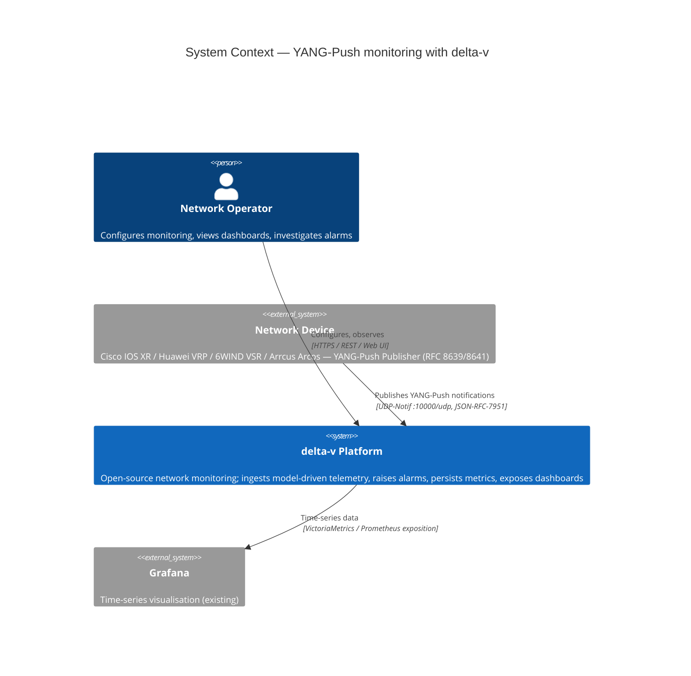
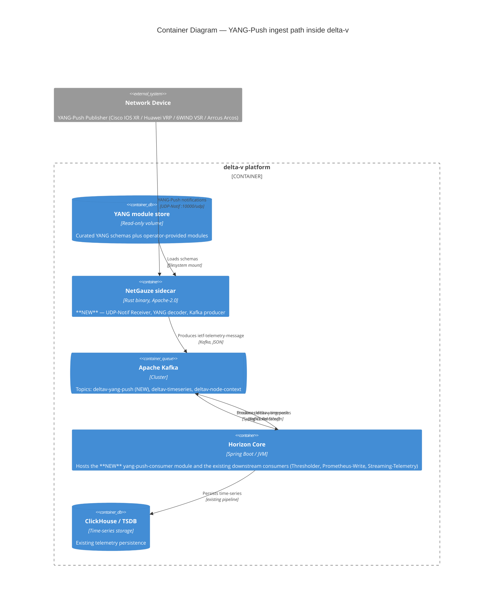

# YANG-Push to Kafka via NetGauze — Design

**Date:** 2026-05-11
**Status:** Decision recorded; Phase 0 spike approved
**Owner:** Indigo
**Related research:**
- `_bmad-output/planning-artifacts/research/technical-ietf-yang-message-broker-integration-fit-research-2026-05-11.md` — full fit analysis and decision matrix
**Related specs:**
- `docs/superpowers/specs/2026-04-12-minion-telemetry-receiver-design.md` — Minion-as-ingress precedent for non-YANG telemetry
- `docs/superpowers/specs/2026-04-15-kafka-time-series-producer-design.md` — `deltav-timeseries` Kafka contract that downstream consumers join against
- `docs/superpowers/specs/2026-03-22-lightweight-docker-images-design.md` — image-size discipline this design must respect

## Problem

`draft-ietf-nmop-yang-message-broker-integration-11` (NMOP WG, Informational, 2026-02-28) defines an end-to-end architecture for shipping YANG-Push notifications from network devices into a Kafka-backed Data Mesh with an associated YANG Schema Registry. Delta-v currently has no path for ingesting model-driven streaming telemetry: there is no YANG runtime on the classpath, no NETCONF/UDP-Notif receiver, and no schema-registry interaction. Operators with vendor gear that publishes YANG-Push (Cisco IOS XR, Huawei VRP, 6WIND VSR, Arrcus Arcos) cannot use delta-v to consume that stream today.

A naive port — write a Netty UDP-Notif listener in Minion, embed OpenDaylight `yangtools`, build a JSON-7951 decoder, project to `TimeseriesBatch` — buys delta-v a lot of code to own. The whole receive-side stack would be ours.

## Non-goals

Out of scope for this design (tracked separately):

- **YANG-Push *Publisher* implementation on delta-v.** Delta-v is a consumer; publishers are vendor devices.
- **Subscription Manager** (push subscription state to devices via NETCONF). Future phase via the Twin API.
- **Stream Catalog / Schema Registry UI.** Not required for v1; revisit once decoded telemetry is flowing.
- **HTTPS-Notif transport.** UDP-Notif is the v1 target; HTTPS-Notif support follows whatever NetGauze ships.
- **Replacing SNMP, IPFIX, or Netflow paths.** YANG-Push runs alongside; this is additive.

## 10,000 ft view

### What changes in the deployment

| | Before | After |
|---|---|---|
| **New containers** | — | `netgauze` (Rust, Apache-2.0, ~256 MB RSS budget) |
| **New Kafka topics** | — | `deltav-yang-push` (ietf-telemetry-message JSON) |
| **New mounted volumes** | — | YANG module store (read-only, in `opennms-container/delta-v/netgauze-overlay/yang-modules/`) |
| **New Maven modules** | — | `core/yang-push-consumer` (plain JAR) |
| **Modified Minion code** | — | none |
| **Modified flow / SNMP pipelines** | — | none |
| **New downstream consumer code** | — | none (reuses Thresholder, Prometheus-Write, Streaming Telemetry — they already read `deltav-timeseries`) |

### Who builds what

| Draft role | Delivered by | Status |
|---|---|---|
| YANG-Push Publisher | Network device (vendor) | external |
| YANG-Push Receiver | NetGauze | reuse |
| YANG decoder | NetGauze | reuse |
| Schema management | NetGauze + filesystem volume | reuse + ops |
| Broker Producer | NetGauze (built-in Kafka producer) | reuse |
| Broker Consumer | `core/yang-push-consumer` (Spring Cloud Stream) | **NEW** |
| Identity attach | KTable join against `deltav-node-context` | reuse |
| Projection → `TimeseriesBatch` | `core/yang-push-consumer` | **NEW** |
| Time-series storage | existing `deltav-timeseries` → ClickHouse | reuse |
| Subscription Manager | deferred (Phase ≥2, via Twin API) | out of scope |
| Stream Catalog | deferred | out of scope |

### Integration contract surface

The integration has only four contractual surfaces, each pin-able and reversible:

1. **Wire ingress** — UDP-Notif `:10000/udp` per `draft-ietf-netconf-udp-notif-25` (device → NetGauze).
2. **Kafka topic shape** — `deltav-yang-push`, JSON, `ietf-telemetry-message` schema per `draft-ietf-nmop-message-broker-telemetry-message-04` (NetGauze → delta-v).
3. **YANG module supply** — filesystem volume curated by the operator (delta-v ships a baseline bundle, ops extends it).
4. **Downstream topic shape** — existing `deltav-timeseries` Protobuf `TimeseriesBatch` (unchanged; consumed by Thresholder, Prometheus-Write, Streaming Telemetry).

If NetGauze is later replaced, only surfaces (1) and (2) change. Everything from `deltav-yang-push` rightward stays put.

### C4 — System Context



### C4 — Container view (delta-v internals)



### Reading the diagrams

- **Everything labelled NEW is the only code delta-v owns:** one container (NetGauze, pulled from upstream as a digest-pinned image — we don't build the binary) and one Java module (`yang-push-consumer`).
- **The Kafka topic is the contract boundary:** swapping NetGauze for a `yangtools`-based receiver later changes only the left half of the container diagram.
- **No new downstream consumers:** YANG-Push metrics ride the existing `deltav-timeseries` topic, so Thresholder / Prometheus-Write / Streaming-Telemetry inherit them for free.

## Decision

**Run NetGauze 0.11.0 as a Rust sidecar in the dev compose stack to act as the YANG-Push Receiver and Kafka Broker Producer.** Delta-v owns only a downstream Kafka consumer that projects NetGauze's `ietf-telemetry-message` output into `TimeseriesBatch`.

### Why NetGauze over OpenDaylight `yangtools`

The full decision matrix and scoring lives in the research brief (`§A.3`). The load-bearing reasons:

1. **Wire-format compatibility is the product feature.** NetGauze emits `ietf-telemetry-message` per `draft-ietf-nmop-message-broker-telemetry-message-04` out of the box (PR #213 merged 2025-06-11, shipped in 0.11.0). With `yangtools` we would have to invent and maintain that projection ourselves.
2. **NetGauze removes whole roles from delta-v's build.** YANG-Push Receiver, Broker Producer, and UDP-Notif decoding are all done by NetGauze. Delta-v's only new code is a Spring Cloud Stream consumer.
3. **License is clean.** NetGauze is Apache-2.0; `yangtools` is EPL-1.0 (ASF "Category B"). Delta-v is AGPL-3.0 — Apache-2.0 is unambiguous.
4. **Karaf is being removed** (`chore/karaf-removal-phase2`, ~1,009 POMs). `yangtools`'s OSGi-native packaging — its biggest in-JVM advantage — no longer counts for delta-v.
5. **Spec tracking comes free.** NetGauze's lead is a co-author of the IETF draft. The implementation moves with the WG.

The two reasons the call isn't trivial:

- **Operational complexity.** NetGauze adds one container to the deploy footprint. Mitigation: keep it as a separate digest-pinned image; do **not** bundle into the Minion image.
- **Bus factor.** NetGauze has a single primary maintainer. Mitigation: open dialog upstream during Phase 0; if the project stalls, the Kafka topic is the contract — we can swap in a `yangtools`-based receiver later without changing downstream consumers.

### Hybrid: `yangtools` at test scope

Keep OpenDaylight `yangtools` at `<scope>test</scope>` in the new consumer module for fixture generation and schema-aware assertions. This costs nothing operationally (no runtime classpath impact) and lets engineers write unit tests against YANG schemas without spinning up the Rust binary.

## Architecture

```
   ┌────────────────────┐
   │  Network device    │
   │ (IOS XR / VRP /    │
   │  VSR / Arcos)      │
   │  YANG-Push         │
   │  Publisher         │
   └─────────┬──────────┘
             │ UDP-Notif (RFC: draft-ietf-netconf-udp-notif-25)
             │ JSON-RFC-7951 payload
             ▼
   ┌────────────────────┐        ┌──────────────────────┐
   │  NetGauze 0.11.0   │        │  YANG module store   │
   │  (Rust sidecar)    │◄───────┤  (mounted volume     │
   │  - UDP-Notif rx    │        │   for YANG schemas)  │
   │  - YANG decode     │        └──────────────────────┘
   │  - Kafka producer  │
   └─────────┬──────────┘
             │ produces `ietf-telemetry-message`
             │ (JSON, per draft-ietf-nmop-message-broker-telemetry-message-04)
             ▼
   ┌────────────────────────────────────────────────────┐
   │  Kafka topic: deltav-yang-push                     │
   │  key = location@publisher-id                       │
   │  (sticky-partitioned, mirrors Phase-1 flow ingress)│
   └─────────┬──────────────────────────────────────────┘
             │ Spring Cloud Stream binding
             ▼
   ┌────────────────────┐
   │ core/yang-push-    │   joins against deltav-node-context
   │   consumer (new)   │   GlobalKTable for identity attach
   │  projects ▶        │
   └─────────┬──────────┘
             │ produces TimeseriesBatch
             ▼
   ┌────────────────────┐
   │ deltav-timeseries  │   shared with Collectd / Pollerd
   │ (existing topic)   │   (per kafka-time-series spec)
   └────────────────────┘
```

Key properties:

1. **Delta-v owns only the consumer.** Receiver, decoder, broker-producer roles all live in NetGauze.
2. **Kafka is the contract boundary.** If NetGauze is later replaced (yangtools, a different Rust collector, or a vendor implementation), downstream consumers are unaffected as long as the topic shape holds.
3. **`deltav-timeseries` is the unifying downstream.** Whether a metric arrives via SNMP/Collectd, future SnmpCollector-on-Minion, or YANG-Push via NetGauze, it lands on the same topic with the same key shape. Thresholder, Prometheus-Write, and Streaming Telemetry consume one topic for everything.
4. **Identity is not on the YANG-Push wire either.** `yang-push-consumer` joins against `deltav-node-context` at consume time, same pattern as the Collectd producer.

## Phase 0 spike — NetGauze in the dev compose stack

**Goal:** Verify that NetGauze 0.11.0 can be run alongside Minion in `opennms-container/delta-v/docker-compose.dev.yml`, that it accepts UDP-Notif from a test publisher, and that it produces `ietf-telemetry-message` records to a Kafka topic in a shape we are willing to commit to as the consumer contract.

**Timebox:** 1 week. If success criteria aren't met by end of week, escalate before committing to Phase 1.

### Tasks

1. **Add a `netgauze` service to `docker-compose.dev.yml`** alongside `minion`:

   ```yaml
   netgauze:
     image: ghcr.io/netgauze/netgauze:0.11.0  # confirm registry/tag during spike
     restart: unless-stopped
     depends_on:
       - kafka
     ports:
       - "10000:10000/udp"   # UDP-Notif
     volumes:
       - ./netgauze-overlay/config.yaml:/etc/netgauze/config.yaml:ro
       - ./netgauze-overlay/yang-modules:/var/lib/netgauze/yang:ro
     command: ["-c", "/etc/netgauze/config.yaml"]
     environment:
       RUST_LOG: info
   ```

   Pin by digest (`@sha256:…`) once a working version is selected. Tag-only is acceptable inside the spike.

2. **Build the NetGauze config** (`netgauze-overlay/config.yaml`):
   - Listener: UDP-Notif on `0.0.0.0:10000`.
   - Kafka producer: bootstrap `kafka:9092`, topic `deltav-yang-push`, JSON encoding.
   - Key strategy: `${remote_address}@${subscription_id}` (substitute exact NetGauze key template once verified).
   - YANG module path: `/var/lib/netgauze/yang`.

3. **Seed YANG modules** under `netgauze-overlay/yang-modules/`:
   - Start with `openconfig-interfaces` and `ietf-interfaces` (NetGauze README examples use these).
   - Document the discovery process for additional modules in the overlay README.

4. **Stand up a YANG-Push test publisher.** Options, in preference order:
   - Recorded UDP-Notif fixture replayed via `nping`/`scapy` (deterministic, no device required) — preferred for repeatable spike output.
   - `softflowd`-equivalent open-source YANG-Push publisher if one exists at spike time.
   - A vendor virtual router (IOS XRv / VRP virtual / 6WIND VSR free tier) — slowest path, deferred unless the fixture path is blocked.

5. **Consume the Kafka topic with `kcat`** and verify:
   - Records arrive on `deltav-yang-push`.
   - JSON parses; top-level structure matches `ietf-telemetry-message` (timestamp, session-protocol, data-collection-manifest, telemetry-message-metadata, payload).
   - `payload` contains a recognisable `push-change-update` envelope.
   - Subscription lifecycle events (`subscription-started`, `subscription-modified`, `subscription-terminated`) propagate as separate messages.

6. **Capture the exact wire shape** (one push-update + one subscription-started, both as committed test fixtures in `core/yang-push-consumer/src/test/resources/fixtures/`). These become the consumer contract.

### Success criteria

The spike succeeds if and only if **all** of the following hold:

- [ ] NetGauze container starts and stays up on the dev compose stack with `< 256 MB` RSS at idle.
- [ ] Test publisher can drive ≥ 100 push-updates/sec into NetGauze with no message loss observable at the Kafka topic.
- [ ] At least one full `push-change-update` and one subscription-lifecycle event are captured as committed fixtures.
- [ ] The captured shape conforms to `draft-ietf-nmop-message-broker-telemetry-message-04` (manual review against the draft; record any divergence).
- [ ] We can articulate the upgrade story (how to move from `0.11.0` to a later release) and the rollback story (revert the compose service, no other system state changes).

### Spike deliverables

- `opennms-container/delta-v/docker-compose.dev.yml` — `netgauze` service block added.
- `opennms-container/delta-v/netgauze-overlay/` — config, YANG modules, README.
- `docs/superpowers/notes/2026-05-NN-yang-push-spike-results.md` — what worked, what surprised us, what we'd change before Phase 1.
- Two committed fixtures (push-update + subscription-started) under the future `core/yang-push-consumer/`.

## Phase 1 outline (post-spike)

After a successful Phase 0 spike, build `core/yang-push-consumer/`:

1. New Maven module, plain JAR (no Karaf feature).
2. Spring Cloud Stream consumer binding for `deltav-yang-push`.
3. Kafka Streams join against `deltav-node-context` GlobalKTable for identity attach (same pattern as `kafka-time-series-phase-1-node-context`).
4. Projection from `ietf-telemetry-message` payload leaves into `TimeseriesBatch` protobuf, produced to `deltav-timeseries`.
5. `<scope>test</scope>` dep on `org.opendaylight.yangtools:yang-data-codec-gson` (or equivalent) for fixture validation only.
6. Feature flag default-off (`org.deltav.yang-push.enabled=false`) until the WG drafts stabilise.

Phase 1 sizing: smaller than the Collectd Kafka producer (no SPI integration, no scheduler, no persister chain). Estimated 2-3 weeks once Phase 0 fixtures are in hand.

## Open questions

These need resolution during Phase 0 or before Phase 1 starts:

1. **NetGauze container image registry.** Does the project publish to GHCR, Docker Hub, or do we need to build from source? Confirm during Phase 0 task 1.
2. **NetGauze config schema stability.** The 0.11.0 YAML is stable enough to commit; will 0.12+ break it? Open an upstream issue during the spike.
3. **YANG module distribution.** Do we ship a curated module set with delta-v, or expect operators to populate `/var/lib/netgauze/yang`? Lean toward "ship a curated baseline, document how to extend."
4. **Topic naming.** `deltav-yang-push` follows the `deltav-*` convention; alternative `OpenNMS.Sink.Telemetry-YangPush` matches the Sink topic pattern. Pick one before Phase 1.
5. **Schema versioning under `draft-ietf-netconf-yang-notifications-versioning-11`.** Watch the WG; build the consumer to log-and-drop unknown versions rather than fail.

## Risks

1. **NetGauze upstream stalls.** Mitigation: Kafka topic is the contract; fall back to `yangtools` in-JVM behind the same topic shape. Reversibility validated by design.
2. **`ietf-telemetry-message` schema churns before WG ratification.** Mitigation: feature flag default-off; revisit fixtures after each draft revision.
3. **YANG module supply chain.** Devices may publish using modules we don't have. Mitigation: NetGauze's behaviour on unknown modules must be verified in Phase 0 task 5 (likely passes through with reduced decoding; document the actual behaviour).
4. **Operational footprint.** One more container per deployment. Mitigation: digest-pinned separate image; never bundled into the Minion image; lab-VM resource budget is already comfortable at 192 MB Minion heap, so a ~256 MB Rust process is within tolerance.

## References

- IETF draft: [draft-ietf-nmop-yang-message-broker-integration-11](https://datatracker.ietf.org/doc/draft-ietf-nmop-yang-message-broker-integration/) (Graf/Elhassany, NMOP WG, 2026-02-28)
- IETF companion: [draft-ietf-nmop-message-broker-telemetry-message-04](https://datatracker.ietf.org/doc/draft-ietf-nmop-message-broker-telemetry-message/)
- IETF companion: [draft-ietf-netconf-udp-notif-25](https://datatracker.ietf.org/doc/draft-ietf-netconf-udp-notif/)
- RFCs: [RFC 8639](https://datatracker.ietf.org/doc/html/rfc8639), [RFC 8641](https://datatracker.ietf.org/doc/html/rfc8641), [RFC 7951](https://datatracker.ietf.org/doc/html/rfc7951)
- [NetGauze (GitHub)](https://github.com/NetGauze/NetGauze) — v0.11.0 released 2026-04-21
- [NetGauze PR #213 — YANG-Push enrichment](https://github.com/NetGauze/NetGauze/pull/213) — merged 2025-06-11
- [OpenDaylight yangtools (GitHub)](https://github.com/opendaylight/yangtools) — v14.0.22 released 2026-01-10 (kept at test scope only)
- [Benoît Claise — YANG-Push & Apache Kafka Integration](https://www.claise.be/yang-telemetry-kafka-integration/)
